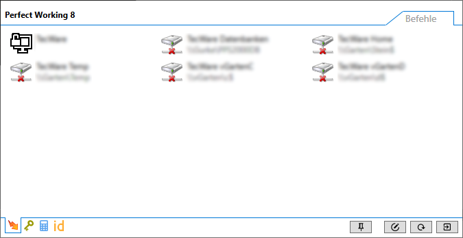

# Perfect Working 8

This is a tray program, that is heavly based on NeoLua. Because, this is a hoppy project,
I will only write help texts in german.

But feel free to translate or ask me question in english.

## Einleitung

Dieses Projekt hat eine lange Geschichte. Es hat für mich von je her
zwei Zwecke. Zum einen ist es ein kleines Programm mit Helfern, die
das Betriebssystem mir nicht passend liefert und zweitens möchte ich
aktuelle Technoligien in einen ungezwungenen Projekt umsetzen.



## Features

- Credential Manager (Passwort Tresor)
- Passwort Generator
- Guid-Genertor
- Smb-Verbindungen verwalten
- Vpn-Verbindungen verwalten
- Taschenrechner
- Starter (via ShortCuts)
- Dashboard


Folgende Bausteine gab es in alten Version und kommen ggf. wieder:

- GamePad-Steuerung

Folgende Bausteine werden nicht mehr benötigt:

- Desktop-Manager

## Start

Die Anwendung benötigt für den Start ein Lua-Skript. Das Skript kann
mittels `--config [script]` beim Start der Anwendung mitgegeben werden.

```Lua
-- Lädt package
package("PW.Calc.dll;CalcPackage");

-- Definiert eine Funktion
local function sendKeyCommand()
	SendKeyData("[Hallo]");
end;

-- Erzeuge ein Package
package("test",
	function (self)
		-- Erzeuge eine Aktion
		self.sendKey = CreateHotKey(title = "Send",  key = "Ctrl+Win+T", command = sendKeyCommand);
	end
);
```

Das Skript organisiert Packages (z.B. `CalcPackage`, `test`). Den Packages können Variablen (z.B. `sendKey`) zugeordnet
werden. Die Lebenszeit der Variablen hängt von der Lebenszeit des Packages
ab. Dies ermöglicht ein Neuladen der Konfiguration zur Laufzeit.

Das gesamte System baut auf diesen Konzept auf.

# Mitmachen

Sprecht mich an...
